I've been playing with developing an alternative version of The Devourer Below. I had few design goal:

1) Stopping the rite was boring in the original version
The core idea is to borrow the mechanic of Black Sonata: 12 glyph cards represent a counter spell to stop Umôrdhoth and hints to identify the right spell. This creates an interesting puzzle.

2) There was little incentive to attempt to stop the rite in case of choosing to fight
In the new version the investigators loose if they have not reached the Rite Site when Umôrdhoth appears.

3) Difficulty to fight Umôrdhoth
If one collects enough hints to reduce the possible words of the rite, the difficulty to fight Umôrdhoth is reduced.

Since this is my first scenario, I would be extremely grateful of any feedback.

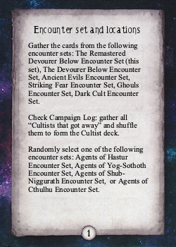
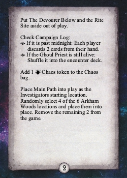
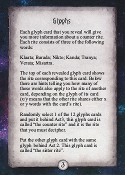
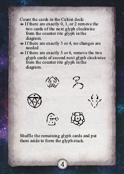
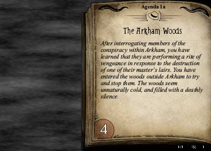
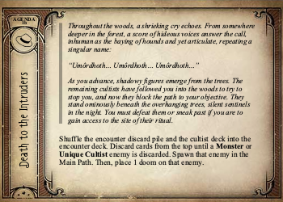
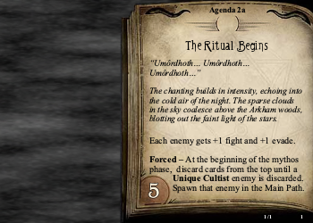
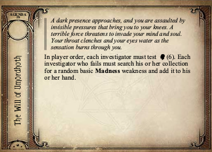
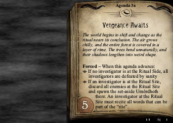
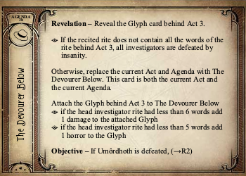
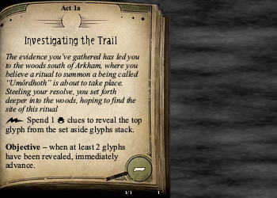
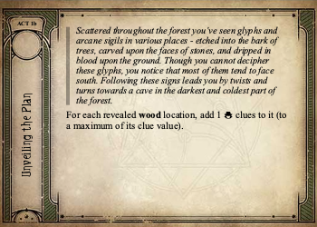
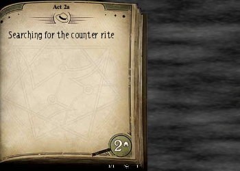
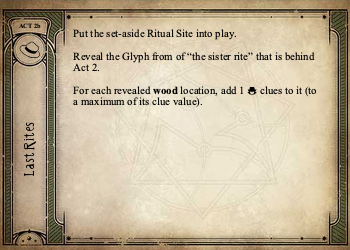
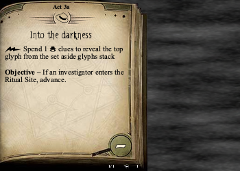
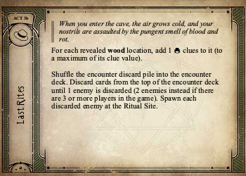
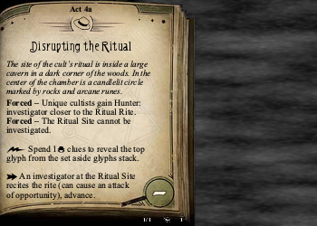
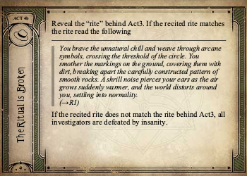

